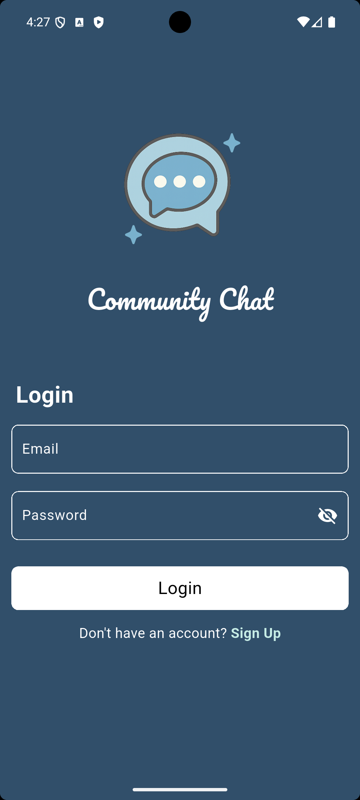
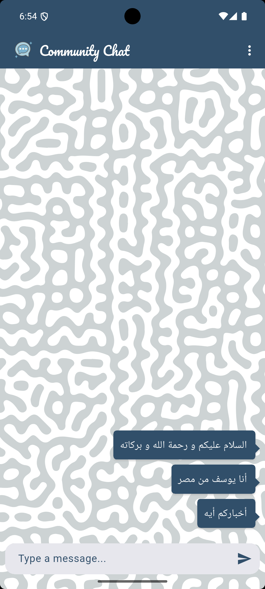
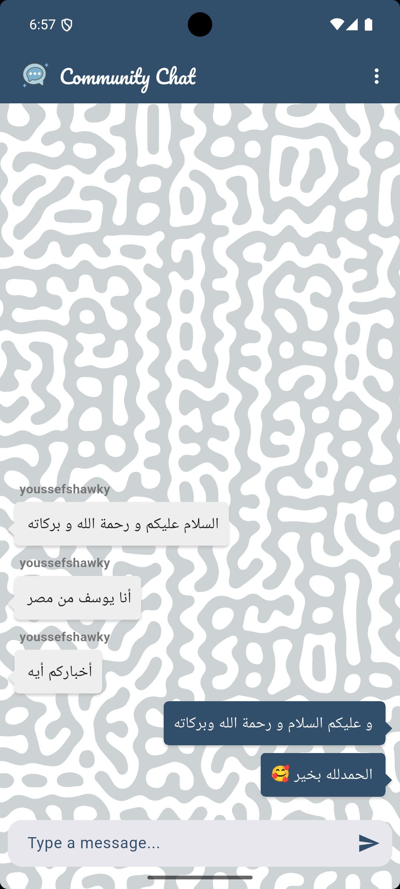
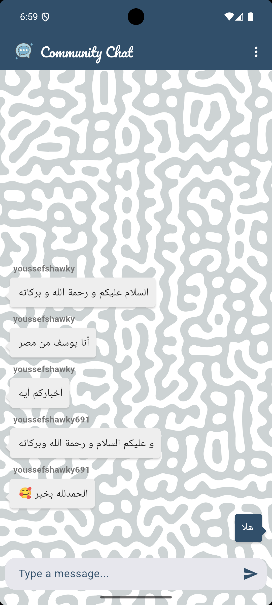
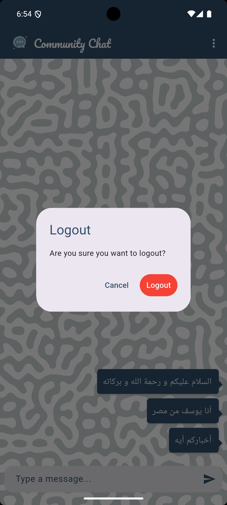

# 💬 Community Chat

**Community Chat** is a sleek and modern Flutter-based messaging app that enables users to communicate in real-time. With a beautiful UI and fast performance, it's designed to bring people together.

---

## 📸 Screenshots

| Login Screen | Sign Up Screen | Chat Screen - 1st User |
|-------------|----------------|-------------------------|
|  |  |  |

| Chat Screen - 2nd User | Chat Screen - 3rd User | Logout Confirmation |
|------------------------|------------------------|---------------------|
|  |  |  |

---

## ✨ Features

- 🖼️ **Custom Splash Screen**: Branded splash screen with app logo and smooth transition to login  
- 🔐 **Secure Authentication**: Email/password sign-up and login using Firebase Auth  
- 💬 **Real-time Messaging**: Instant message updates with Cloud Firestore  
- 👤 **User-Friendly UI**: Beautiful chat bubbles with sender identification  
- 🌈 **Custom Design**: Consistent theming across the app  
- 📱 **Responsive Layout**: Works on both mobile and tablet devices  
- 🔄 **Auto-Sync**: Messages update in real-time across all devices  
- ⚡ **Optimized Performance**: Smooth scrolling and fast loading  
- 🚪 **Session Management**: Secure logout with confirmation dialog  

---

## 🛠️ Tech Stack  

- **Flutter** - Cross-platform UI framework  
- **Firebase Auth** - User authentication  
- **Cloud Firestore** - Real-time database  
- **flutter_chat_bubble** - Beautiful chat UI components  
- **modal_progress_hud_nsn** - Loading indicators  

---

## 📁 Project Structure

```
lib/
├── constants.dart
├── firebase_options.dart
├── helper/
│   └── show_snack_bar.dart
├── models/
│   └── message_model.dart
├── pages/
│   ├── home_page.dart
│   ├── login_page.dart
│   └── signup_page.dart
├── widgets/
│   ├── custom_button.dart
│   ├── custom_form_text_field.dart
│   ├── info_title.dart
│   └── send_message_box.dart
└── main.dart
```

---

## ⚙️ Getting Started

1. Clone this repository:

```bash
git clone https://github.com/yourusername/community_chat.git
```

2. Navigate to the project directory:

```bash
cd community_chat
```

3. Install dependencies:

```bash
flutter pub get
```

4. Run the app:

```bash
flutter run
```

## License

This project is licensed under the MIT License - see the LICENSE file for details.

# Enjoy chatting! 💙
